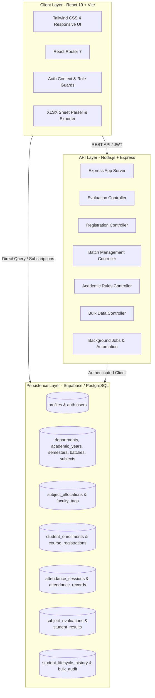

# 🎓 MySpace — Enterprise University ERP & Learning Management System

<div align="center">

[](https://react.dev/)
[](https://vitejs.dev/)
[](https://nodejs.org/)
[](https://expressjs.com/)
[](https://supabase.com/)
[](https://tailwindcss.com/)
[](https://opensource.org/licenses/MIT)

**A next-generation, high-performance Enterprise University ERP and Learning Management System inspired by TCS iON, Oracle PeopleSoft Campus Solutions, and SAP Student Lifecycle Management.**

[Key Features](#-key-features) • [Architecture](#-system-architecture) • [Modules](#-core-erp-modules) • [Installation](#-quick-start--installation) • [Database Migrations](#-database-schema--migrations) • [API Reference](#-api-endpoints)

</div>

---

## 🌟 Overview

**MySpace (MIT-Learn)** is a comprehensive, multi-tenant university academic management platform designed for modern universities and higher-education institutions. It unifies academic governance, student lifecycle management, course registration, attendance tracking, faculty workload allocation, continuous evaluation, degree audits, and institutional analytics into a cohesive, lightning-fast web application.

---

## 🚀 Key Features

### 📊 1. Subject Evaluation & Continuous Assessment (CA) System
- **Excel-like Interactive Spreadsheet**: In-browser marks grid with keyboard navigation (`Tab` / `Enter`), real-time auto-computation, and unsaved changes tracking.
- **Dynamic Assessment Scheme**:
  - **Theory Subjects**: Continuous Assessment with **Attendance Marks**, **TA-1**, **TA-2**, **TA-3** (Teacher Assessments) + **Theory Exam**.
  - **Practical Subjects**: Dynamically switches to **Attendance Marks**, **PAB-1**, **PAB-2**, **PAB-3** (Practical Assessment Batch) + **Practical Exam**.
- **Real-Time Attendance Sync**: Dynamic calculation of real student attendance percentages with color-coded health badges and a **1-click "Auto-Fill Attendance CA"** engine.
- **Excel (.xlsx) & CSV Import/Export**: Export formatted rosters; import marks via drag & drop with column auto-matching, discrepancy diff preview, and batch database upserts.
- **Locking & Workflow Control**: Faculty can save in-progress drafts or lock and finalize evaluation mark sheets.
- **Dedicated Student View**: Students view their exact CA breakdown, exam scores, and live attendance metrics.
- **Admin Hub**: University-wide portal to monitor grading progress, completion percentages, and institutional pass rates.

### 📚 2. Academic Progression & Rules Engine
- **Academic Hierarchy**: Strict referential integrity spanning Departments $\rightarrow$ Academic Years (`FY`, `SY`, `TY`, `LY`) $\rightarrow$ Semesters (1–8) $\rightarrow$ Batches $\rightarrow$ Subjects.
- **Dynamic Rule Configurator**: Configurable attendance thresholds (e.g. 75%), max backlog limits, SGPA/CGPA passing criteria, and prerequisite validation.
- **Student Lifecycle Engine**: Finite State Machine tracking student stages (`APPLIED` $\rightarrow$ `ADMITTED` $\rightarrow$ `REGISTERED` $\rightarrow$ `COURSE_REGISTERED` $\rightarrow$ `ACTIVE` $\rightarrow$ `PROMOTED` $\rightarrow$ `GRADUATED`).
- **Academic Promotion & Backlog Pipeline**: Batch promotion processing with carry-forward backlog generation and promotion history auditing.

### 🎖️ 3. Enterprise Credit System & Degree Audit (CBCS)
- **Choice-Based Credit System (CBCS)**: Real-time calculation of Registered Credits, Earned Credits, Pending Credits, Semester Grade Point Average (SGPA), and Cumulative Grade Point Average (CGPA).
- **Graduation & Degree Eligibility Check**: Automated degree auditing against minimum graduation credit rules, core/elective credit requirements, and backlog clearance.

### 📝 4. Enterprise Course Registration System
- **Registration Windows**: Time-bound registration periods per Academic Year & Semester.
- **Credit Range Bounds**: Configurable min/max credit caps per registration session.
- **Prerequisite Validation**: Prevents enrollment if previous prerequisite subjects have not been cleared.
- **Auto-Sync**: Synchronizes approved registrations directly into student enrollments.

### 🏫 5. Class & Practical Batch Management
- **Smart Sectioning**: Auto-generates practical lab batches (e.g. dividing 70 students into balanced batches of 24, 23, 23).
- **Student Transfers & Reassignments**: Batch transfer management with immutable audit logs.
- **Class Teacher & Coordinator Mapping**: Assign coordinators and class teachers to cohorts.

### 👥 6. Faculty Subject Allocation & Preferences
- **Faculty Teaching Preference Calls**: Admins broadcast subject preference announcements; faculty submit ranked preferences.
- **Faculty Expertise Tagging**: Tag faculty members with specialization tags and experience levels.
- **Conflict Prevention**: Unique allocation constraints preventing dual assignments to the same batch.

### 📈 7. Institutional Analytics, Audit Center & Bulk Data Hub
- **Enterprise Bulk Data Center**: 9-module bulk import/export catalog (Students, Faculty, Subjects, Batches, Marks, Registrations, Attendance) with row-level error logging.
- **Student 360 Profile**: 360-degree student overview containing attendance history, financial status, academic timeline, and disciplinary logs.
- **Institutional Analytics**: Real-time KPI dashboards, enrollment trends, grade distributions, and resource utilization.
- **Enterprise Audit Center**: Tamper-evident logging of administrative overrides, grade adjustments, and lifecycle state changes.

---

## 🏗️ System Architecture



---

## 🛠️ Tech Stack

| Layer | Technologies & Libraries |
| :--- | :--- |
| **Frontend Framework** | React 19.2.0, Vite 7.3.1, React Router 7.12.0 |
| **Styling & UI** | Tailwind CSS 4.1.18, Vanilla CSS Design System, Lucide React 0.563.0 |
| **Data & Spreadsheet** | SheetJS (XLSX 0.18.5), Recharts 3.7.0, Date-Fns 4.1.0 |
| **Backend Framework** | Node.js, Express 4.18.2, Nodemon, Dotenv |
| **Database & Auth** | Supabase (PostgreSQL 15), Row Level Security (RLS), Supabase Auth |
| **Media & Storage** | Cloudinary v2, Multer, Supabase Storage |
| **Background Processing** | Node-Cron 4.6.0 |
| **Testing** | Jest 29.7.0, Supertest 6.3.4 |

---

## 🎭 Role-Based Permissions Matrix

| ERP Module | Student | Faculty | HOD | Dean | Admin |
| :--- | :---: | :---: | :---: | :---: | :---: |
| **Student Dashboard & Courses** | ✅ Full | 👁️ Read | 👁️ Read | 👁️ Read | 👁️ Read |
| **Course Registration** | ✅ Submit | 👁️ Read | ⚖️ Review | ⚖️ Review | ⚙️ Manage |
| **Live Attendance System** | 👁️ View Own | ✍️ Mark | 👁️ Dept View | 👁️ All | ⚙️ All |
| **Subject Evaluation (CA Marks)**| 👁️ View Own | ✍️ Edit & Lock | 👁️ Dept View | 👁️ All | ⚙️ All & Export |
| **Credit Portfolio & Audit** | 👁️ View Own | 👁️ View | 👁️ Dept View | 👁️ All | ⚙️ Full Audit |
| **Class & Batch Management** | 👁️ View Batch | 👁️ View | ⚙️ Manage | ⚙️ Manage | ⚙️ Full Portal |
| **Academic Rules Engine** | ❌ | ❌ | 👁️ Read | ⚖️ Manage | ⚙️ Full Admin |
| **Student Lifecycle Engine** | 👁️ Timeline | ❌ | ⚖️ Transition | ⚖️ Transition | ⚙️ Override |
| **Enterprise Bulk Data Hub** | ❌ | ❌ | ❌ | 👁️ Read | ⚙️ Full Import/Export |
| **Institutional Analytics** | ❌ | ❌ | 👁️ Dept | 📊 University | 📊 Full Suite |

---

## 🚀 Quick Start & Installation

### Prerequisites
- **Node.js**: v18.0.0 or higher
- **npm**: v9.0.0 or higher
- **Supabase Account**: A Supabase project with PostgreSQL

### 1. Clone the Repository
```bash
git clone https://github.com/not-so-Vaibhav/myspace.git
cd myspace
```

### 2. Configure Environment Variables

#### Backend (`backend/.env`):
```env
PORT=5001
SUPABASE_URL=https://your-project.supabase.co
SUPABASE_ANON_KEY=your-supabase-anon-key
SUPABASE_SERVICE_ROLE_KEY=your-supabase-service-role-key # optional for full RLS bypass
CLOUDINARY_CLOUD_NAME=your-cloud-name
CLOUDINARY_API_KEY=your-cloudinary-key
CLOUDINARY_API_SECRET=your-cloudinary-secret
```

#### Frontend (`frontend/.env`):
```env
VITE_SUPABASE_URL=https://your-project.supabase.co
VITE_SUPABASE_ANON_KEY=your-supabase-anon-key
VITE_API_BASE_URL=http://localhost:5001/api
```

---

### 3. Install Dependencies & Start Dev Servers

#### Start Backend API Server:
```bash
cd backend
npm install
npm run dev
# Backend starts on http://localhost:5001
```

#### Start Frontend Application:
```bash
cd ../frontend
npm install
npm run dev
# Frontend starts on http://127.0.0.1:5173
```

---

## 🗄️ Database Schema & Migrations

All SQL migration scripts are located in the repository root for seamless execution in the **Supabase SQL Editor**:

| Migration Script | Description |
| :--- | :--- |
| [`academic_structure.sql`](./academic_structure.sql) | Departments, academic years, semesters, batches, subjects |
| [`subject_allocations.sql`](./subject_allocations.sql) | Faculty subject allocation mappings and validation triggers |
| [`attendance_schema.sql`](./attendance_schema.sql) | Attendance sessions and student attendance records |
| [`create_subject_evaluation_system.sql`](./create_subject_evaluation_system.sql) | CA subunits (TA/PAB), attendance marks, exams, and RLS |
| [`create_course_registration.sql`](./create_course_registration.sql) | Time-bounded course registration windows and credit limits |
| [`create_enterprise_credit_system.sql`](./create_enterprise_credit_system.sql) | Choice-based credit system, SGPA/CGPA, and degree audit |
| [`create_batch_management_system.sql`](./create_batch_management_system.sql) | Cohorts, practical batches auto-division, and transfer logs |
| [`create_student_lifecycle.sql`](./create_student_lifecycle.sql) | Lifecycle state transitions and audit logs |
| [`create_academic_rules.sql`](./create_academic_rules.sql) | Dynamic academic rules and validation constraints |
| [`create_enterprise_bulk_data_system.sql`](./create_enterprise_bulk_data_system.sql) | Import/export template catalog and error tracking |

---

## 📡 API Endpoints

### Evaluation & Marks (`/api/evaluation`)
- `GET /api/evaluation/allocations?facultyId=:id` — Fetch allocations with evaluation progress
- `GET /api/evaluation/sheet/:allocationId` — Get student roster with live attendance % and marks
- `POST /api/evaluation/save-batch` — Batch upsert CA subunits and exam marks
- `POST /api/evaluation/lock/:allocationId` — Lock/finalize evaluation mark sheets
- `GET /api/evaluation/student/my-evaluations?studentId=:id` — Student's own mark breakdown
- `GET /api/evaluation/admin/all` — Institutional evaluation summary and completion metrics

### Course Registration (`/api/registration`)
- `GET /api/registration/windows/active` — Fetch current open registration windows
- `POST /api/registration/submit` — Submit course selection for semester
- `POST /api/registration/review` — HOD/Dean approval workflow

### Class & Batch Management (`/api/academic-batches`)
- `GET /api/academic-batches/classes` — List academic classes and cohorts
- `POST /api/academic-batches/batches/auto-generate` — Auto-generate practical batches
- `POST /api/academic-batches/transfers/batch` — Transfer student between batches

### Bulk Data Management (`/api/bulk-data`)
- `GET /api/bulk-data/templates/:module/:entity` — Get schema template
- `POST /api/bulk-data/import/:module/:entity` — Bulk import CSV/Excel with validation

---

## 🧪 Testing

Run backend unit and integration test suites:
```bash
cd backend
npm test
# Run specific test suite:
npx jest tests/evaluationEngine.test.js
```

Verify frontend build integrity:
```bash
cd frontend
npm run build
```

---

## 📄 License

This project is licensed under the **MIT License** — see the [LICENSE](./LICENSE) file for details.

---

<div align="center">
  <b>Built with ❤️ by Vaibhav Bariyar for Modern University Academic Operations</b>
</div>