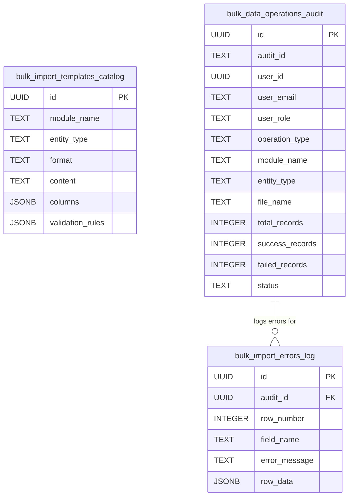

# Phase 8: Enterprise Bulk Data Management System Architecture
**Enterprise University ERP (TCS iON / Oracle PeopleSoft Campus Solutions / SAP Campus Management Style)**

---

## 1. Executive Summary

Phase 8 introduces a **Centralized Enterprise Bulk Data Management System**, serving as a modular, additive framework that integrates with all core modules of the University ERP. Instead of siloed or duplicated import/export scripts across features, the Enterprise Bulk Data Hub provides a unified, reusable engine for:
1. **Template Management & Distribution**: Centralized catalog of CSV and JSON templates with required headers, validation rules, and sample records for all 9 ERP modules.
2. **Multi-Stage Pre-Import Validation Preview**: Automatic validation of uploaded CSV and JSON files before database persistence, flagging syntax errors, missing mandatory fields, in-file duplicate records, and academic rule violations.
3. **Partial-Success & Row-Level Error Reporting**: Ability to execute bulk imports with partial success (committing valid rows while skipping error rows) and generating downloadable error reports with exact row numbers, field names, and failure reasons.
4. **Role-Based Filtered Data Export**: Standardized export engine supporting **CSV**, **JSON**, **EXCEL (.xlsx)**, and **PDF / Print-Ready** formats, enforcing strict Role-Based Access Control (RBAC) so users only export data within their security perimeter.
5. **Full Audit Trail**: Immutable logging of all bulk import and export operations, recording user identity (`user_id`, `email`, `role`), operation timestamps, record counts, and status (`SUCCESS`, `PARTIAL_SUCCESS`, `FAILED`).

---

## 2. Universal 9-Module Integration Matrix

The centralized framework (`enterpriseBulkDataService.js`) supports standardized bulk import and export across **all 9 core ERP modules**:

| Module Code | Entity Type | Supported Formats | Core Unique Identifier | Validation Rules Applied |
| :--- | :--- | :--- | :--- | :--- |
| **STUDENT** | `students` | CSV, JSON | `email` / `enrollment_no` | Mandatory email & full name, semester range (1–8), valid department |
| **FACULTY** | `faculty` | CSV, JSON | `email` | Mandatory email & full name, valid department, role designation |
| **COURSE** | `subjects` | CSV, JSON | `code` | Unique subject code, valid credit range (1.0–6.0), hour breakdown matching total |
| **CLASS_BATCH** | `classes` | CSV, JSON | `class_name` | Unique class name, valid year level (`First Year`–`Fourth Year`), capacity > 0 |
| **CLASS_BATCH** | `batches` | CSV, JSON | `batch_name` | Valid batch name, parent class existence check, assigned lab room |
| **REGISTRATION** | `registrations` | CSV, JSON | `student_email` + `subject_code` | Active student email check, course prerequisite validation, semester limits |
| **ATTENDANCE** | `attendance` | CSV, JSON | `student_email` + `date` | Date range check, valid status (`present`, `absent`, `late`, `excused`) |
| **EXAMINATION** | `marks` | CSV, JSON | `student_email` + `subject_code` | Internal marks (0–40), external marks (0–60), total marks sum check |
| **CREDIT** | `credit_rules` | CSV, JSON | `department` | Min semester credits <= Max semester credits, graduation threshold validation |

---

## 3. Database Architecture & Additive SQL Schema

The database schema (`create_enterprise_bulk_data_system.sql`) is non-destructive and additive, creating three centralized tables:

---

## 4. Multi-Stage Pre-Import Validation Engine

Before any database write occurs, uploaded CSV or JSON file buffers pass through a 3-stage validation sequence in `enterpriseBulkDataService.validateImport`:

1. **Stage 1: File Parsing & Schema Conformity Check**:
   - Verifies file format (`CSV` or `JSON`).
   - Confirms presence of required header columns defined in `bulk_import_templates_catalog`.
2. **Stage 2: Row-Level Mandatory Field & Data Type Check**:
   - Validates that mandatory fields (e.g., `email`, `code`, `enrollment_no`) are non-empty.
   - Enforces data type and range bounds (e.g., semester between 1 and 8, internal marks <= 40).
3. **Stage 3: Duplicate Record Detection**:
   - Detects in-file duplicate keys (e.g., repeating student emails or subject codes within the same upload).

### Row Error Highlighting & Preview Modal
The frontend modal (`BulkDataModal.jsx`) displays an interactive preview:
- Shows summary KPI tiles: **Total Rows**, **Valid Rows**, and **Error Rows**.
- Highlights invalid rows in light red with exact badges showing the column and error description.
- Users can choose to execute a **Partial Import** (importing only valid rows while recording error logs) or abort to fix the source file.

---

## 5. Role-Based Filtered Data Export (RBAC)

The export engine (`enterpriseBulkDataService.exportData` and `ExportMenuButton.jsx`) provides multi-format exports for any ERP data table while enforcing security:

- **Admin / Dean / HOD**: Can export full departmental or institutional datasets across all modules.
- **Faculty / Instructor**: Can export course-scoped rosters, attendance logs, and examination marksheets.
- **Student**: Restricted by RLS and service logic to exporting only their own academic transcript, timetable, and attendance summary.
- **Supported Export Formats**:
  - `CSV`: Comma-separated values (`text/csv`).
  - `JSON`: Formatted JSON (`application/json`).
  - `EXCEL`: Office Open XML SpreadsheetML (`application/vnd.openxmlformats-officedocument.spreadsheetml.sheet`).
  - `PDF`: Document format for archival or immediate browser printing (`application/pdf`).

---

## 6. Frontend Hub & Navigation

### Enterprise Bulk Data Hub (`/admin/bulk-data`)
The centralized dashboard (`EnterpriseBulkDataCenter.jsx`) is accessible via the sidebar navigation item **"Enterprise Bulk Data Hub"** for `admin`, `dean`, and `hod` roles.
Key UI components:
- **Module Filter Bar**: Instant switching between `ALL`, `STUDENT`, `FACULTY`, `COURSE`, `CLASS_BATCH`, `REGISTRATION`, `ATTENDANCE`, `EXAMINATION`, and `CREDIT`.
- **Template Download Center**: One-click download of CSV or JSON templates with pre-configured headers and example rows.
- **Unified Import Modal (`BulkDataModal`)**: Drag-and-drop file upload with multi-stage validation preview and partial-success controls.
- **Export Menu Button (`ExportMenuButton`)**: Dropdown providing Excel, CSV, JSON, and PDF/Print export triggers.
- **Audit & Error Log Center**: Filterable table of past import/export operations, with modal drill-down into specific row-level import errors.

---

## 7. Verification & Automated Test Suite

### Jest Test Suite (`backend/tests/enterpriseBulkDataEngine.test.js`)
All 7 core enterprise requirements are verified by automated tests:
- **Test 1**: Template retrieval across all 9 core ERP modules (`STUDENT`, `FACULTY`, `COURSE`, `CLASS_BATCH`, `REGISTRATION`, `ATTENDANCE`, `EXAMINATION`, `CREDIT`).
- **Test 2**: CSV and JSON file parsing buffer decoding.
- **Test 3**: Multi-stage validation preview detecting missing mandatory fields, duplicate records, and academic rule range violations.
- **Test 4**: Examination mark bounds validation (internal + external mark threshold check).
- **Test 5**: Bulk import execution with partial-success handling and row-level error reporting.
- **Test 6**: Filtered data export across `CSV`, `JSON`, `EXCEL`, and `PDF` formats.
- **Test 7**: Role-Based Access Control (RBAC) verification on student exports.

### Build Verification
- **Frontend Bundle**: Verified zero build errors via `npm run build` in `/frontend/` (`✓ built in 3.46s`).
- **Backend Server**: Verified clean loading of routes `/api/bulk-data/*` and zero syntax or startup regressions.
